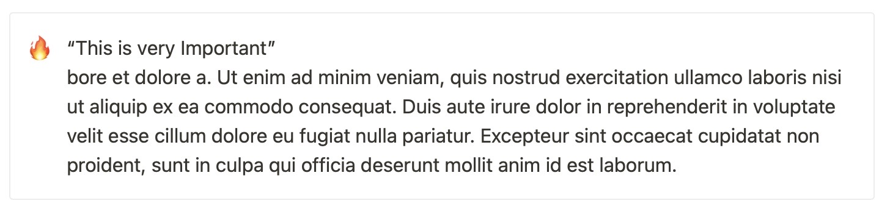

# Notion to MkDocs
Export Notion Data, format for MkDocs

Build upon: [Notion to Markdown](https://github.com/souvikinator/notion-to-md)


## Get Notion Key

[Create a Notion Integration and get your Secret Key.](https://www.notion.so/my-integrations)

## Usage

```zsh
npm install
export NOTION_KEY="<your secret key>"
export PAGE_ID="<your page id>"
node index.js
```

## User Guide

### Admonitions

Admonitions are mapped from Notion's _callout_, the emoji in the callout defines the type of admonition.

#### Admonition Types

‼️ = attention  
⚠️ = caution, warning  
🔥 = danger  
❌ = error  
💡 = hint, tip  
ℹ️ = important  

#### Admonition Titles

If the first line is enclosed in quotes, it will become the title of the admonition:
Example: `“This is very Important”`




## To Do

- [ ] Tables
- [ ] Child Pages
- [ ] MkDocs File Names & Structure
- [ ] Compress/Resize JPEGs
